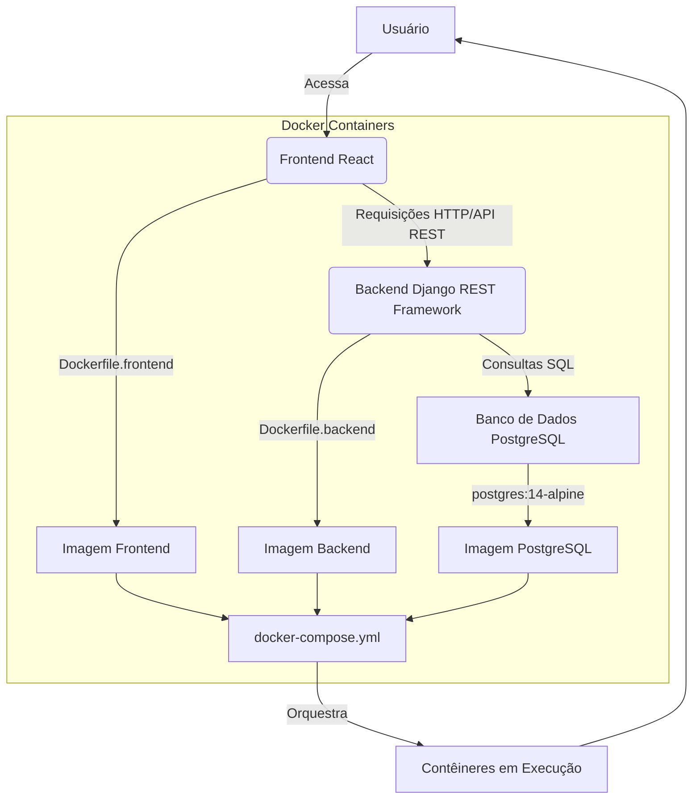

# Documentação Geral do Projeto TaskManager

## Visão Geral

O TaskManager é uma aplicação completa para gerenciamento de tarefas, composta por um backend robusto desenvolvido em Django REST Framework e um frontend interativo construído com React. O objetivo principal é fornecer uma plataforma intuitiva e eficiente para que os usuários possam organizar suas tarefas, listas, categorias e etiquetas, otimizando a produtividade pessoal e profissional.

## Arquitetura do Sistema

O sistema TaskManager segue uma arquitetura de microsserviços simplificada, com uma clara separação entre o backend (API) e o frontend (interface do usuário). A comunicação entre as duas partes é realizada através de requisições HTTP, utilizando a API RESTful fornecida pelo backend.

### Componentes Principais

1.  **Backend (API)**:
    *   **Tecnologia**: Django REST Framework (Python)
    *   **Função**: Gerencia a lógica de negócios, persistência de dados e exposição de endpoints RESTful para manipulação de tarefas, usuários, categorias, tags e listas.
    *   **Banco de Dados**: PostgreSQL (configurado via Docker).
    *   **Autenticação**: Baseada em Token, garantindo segurança nas interações com a API.

2.  **Frontend (Interface do Usuário)**:
    *   **Tecnologia**: React (JavaScript/TypeScript)
    *   **Função**: Proporciona uma interface de usuário rica e responsiva, consumindo os dados da API para exibir e permitir a interação com as funcionalidades de gerenciamento de tarefas.
    *   **Ferramentas de Build**: Vite para um desenvolvimento rápido e otimizado.
    *   **Estilização**: Tailwind CSS para um design moderno e flexível.

3.  **Docker e Docker Compose**:
    *   **Função**: Utilizado para orquestrar e isolar os ambientes de desenvolvimento e produção do backend, frontend e banco de dados, garantindo portabilidade e facilidade de setup.
    *   **Serviços**: `db` (PostgreSQL), `backend` (Django), `frontend` (React), e opcionalmente `nginx` (para produção).

### Diagrama de Arquitetura



## Funcionalidades Principais

O TaskManager oferece um conjunto abrangente de funcionalidades para gerenciamento de tarefas:

*   **Gerenciamento de Usuários**: Registro, login, logout e atualização de perfil.
*   **Tarefas**: Criação, visualização, edição, exclusão, marcação como concluída/incompleta.
    *   Suporte a prioridades (baixa, média, alta), datas de vencimento, lembretes e duração estimada.
    *   Subtarefas para decomposição de tarefas complexas.
*   **Listas de Tarefas**: Agrupamento de tarefas por projetos ou contextos específicos.
*   **Categorias**: Classificação de tarefas por tipo (ex: Trabalho, Pessoal, Estudos).
*   **Etiquetas (Tags)**: Marcação flexível de tarefas para organização e busca.
*   **Filtros e Busca**: Capacidade de filtrar e buscar tarefas por diversos critérios (status, prioridade, categoria, texto).
*   **Histórico de Conclusão**: Registro de informações sobre a conclusão de tarefas para análise.

## Estrutura do Projeto

O projeto está organizado em uma estrutura de diretórios que reflete a separação entre backend e frontend, além dos arquivos de configuração do Docker.

```
. (raiz do projeto)
├── docker-compose.yml           # Orquestração dos serviços Docker
├── Dockerfile.backend           # Dockerfile para o serviço de backend
├── Dockerfile.frontend          # Dockerfile para o serviço de frontend
├── nginx.conf                   # Configuração Nginx (opcional para produção)
├── init-db.sql                  # Script de inicialização do banco de dados
├── README.md                    # README principal do projeto (este arquivo)
├── PROJECT_DOCUMENTATION.md     # Documentação geral do projeto (este arquivo)
├── backend/                     # Diretório do projeto Django (Taskmanager)
│   ├── taskmanager/             # Aplicação Django principal
│   │   ├── API_DOCUMENTATION.md   # Documentação da API
│   │   ├── MODELS_DOCUMENTATION.md# Documentação dos modelos do DB
│   │   ├── QUICK_START.md       # Guia de início rápido do backend
│   │   ├── accounts/            # Aplicação de contas de usuário
│   │   ├── categories/          # Aplicação de categorias
│   │   ├── lists/               # Aplicação de listas de tarefas
│   │   ├── tasks/               # Aplicação de tarefas e subtarefas
│   │   ├── tags/                # Aplicação de tags
│   │   ├── manage.py            # Utilitário de linha de comando do Django
│   │   ├── requirements.txt     # Dependências Python do backend
│   │   └── ...                  # Outros arquivos do Django
│   └── ...
└── frontend/                    # Diretório do projeto React (Taskmaster-frontend)
    ├── taskmaster-frontend/     # Aplicação React principal
    │   ├── public/              # Arquivos estáticos públicos
    │   ├── src/                 # Código fonte da aplicação React
    │   │   ├── components/      # Componentes reutilizáveis
    │   │   ├── pages/           # Páginas da aplicação
    │   │   ├── services/        # Serviços de comunicação com a API
    │   │   └── utils/           # Funções utilitárias
    │   ├── package.json         # Dependências Node.js do frontend
    │   ├── pnpm-lock.yaml       # Lockfile do pnpm
    │   ├── vite.config.js       # Configuração do Vite
    │   ├── tailwind.config.js   # Configuração do Tailwind CSS
    │   ├── README.md            # README específico do frontend
    │   └── ...                  # Outros arquivos do React
    └── ...
```

## Tecnologias Utilizadas

### Backend

*   **Linguagem**: Python 3.11
*   **Framework Web**: Django 4.x
*   **API Framework**: Django REST Framework
*   **Banco de Dados**: PostgreSQL
*   **Servidor Web**: Gunicorn

### Frontend

*   **Linguagem**: JavaScript / TypeScript
*   **Framework UI**: React 18.x
*   **Build Tool**: Vite
*   **Estilização**: Tailwind CSS
*   **Gerenciador de Pacotes**: pnpm

### Orquestração e Contêineres

*   **Contêineres**: Docker
*   **Orquestração**: Docker Compose
*   **Servidor Web (Proxy)**: Nginx (opcional)

## Próximos Passos e Melhorias

*   **Implementação de Notificações**: Adicionar sistema de notificações para lembretes de tarefas e eventos.
*   **Relatórios e Análises**: Desenvolver dashboards e relatórios para visualização do progresso e produtividade.
*   **Testes Abrangentes**: Expandir a cobertura de testes unitários e de integração para garantir a robustez do sistema.
*   **Otimização de Performance**: Continuar otimizando consultas de banco de dados e renderização do frontend.
*   **CI/CD**: Configurar pipelines de Integração Contínua e Entrega Contínua para automatizar o deploy.
*   **Internacionalização**: Suporte a múltiplos idiomas.

## Contribuição

Para informações sobre como contribuir com o projeto, consulte o `README.md` principal e os `README.md` específicos de cada módulo (backend e frontend).

## Licença

Este projeto está licenciado sob a licença MIT. Consulte o arquivo `LICENSE` na raiz do repositório para mais detalhes.


