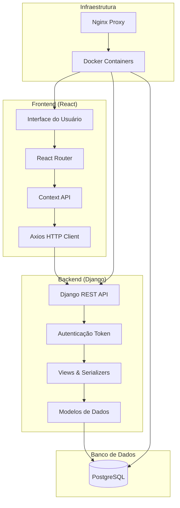

# TaskManager - Sistema Completo de Gerenciamento de Tarefas

<div align="center">


**Sistema moderno e completo para gerenciamento de tarefas, listas, categorias e tags**

[](https://djangoproject.com/)
[](https://reactjs.org/)
[](https://docker.com/)
[](https://postgresql.org/)

[🚀 Demo](#demo) • [📖 Documentação](#documentação) • [⚡ Início Rápido](#início-rápido) • [🤝 Contribuição](#contribuição)

</div>

---

## 📋 Índice

- [Sobre o Projeto](#sobre-o-projeto)
- [Funcionalidades](#funcionalidades)
- [Tecnologias](#tecnologias)
- [Arquitetura](#arquitetura)
- [Início Rápido](#início-rápido)
- [Configuração](#configuração)
- [API](#api)
- [Frontend](#frontend)
- [Deploy](#deploy)
- [Documentação](#documentação)
- [Contribuição](#contribuição)
- [Licença](#licença)

---

## 🎯 Sobre o Projeto

O **TaskManager** é uma solução completa e moderna para gerenciamento de tarefas pessoais e profissionais. Desenvolvido com as melhores práticas de desenvolvimento web, oferece uma experiência rica tanto para usuários finais quanto para desenvolvedores.

### 🌟 Destaques

- **Interface Moderna**: Design responsivo e intuitivo com React e TailwindCSS
- **API Robusta**: Backend completo com Django REST Framework
- **Containerizado**: Deploy simplificado com Docker e Docker Compose
- **Escalável**: Arquitetura preparada para crescimento
- **Documentado**: Documentação completa da API e código

---

## ✨ Funcionalidades

### 🎯 Gerenciamento de Tarefas
- ✅ **CRUD Completo**: Criar, visualizar, editar e excluir tarefas
- 📅 **Datas e Prazos**: Controle de vencimento e lembretes
- 🎨 **Prioridades**: Sistema de prioridades (baixa, média, alta)
- 📝 **Subtarefas**: Decomposição de tarefas complexas
- ⏱️ **Duração Estimada**: Controle de tempo estimado vs real
- 📊 **Status**: Controle de conclusão com histórico

### 🗂️ Organização
- 📋 **Listas**: Agrupamento por projetos ou contextos
- 🏷️ **Categorias**: Classificação com cores personalizadas
- 🔖 **Tags**: Marcação flexível e busca avançada
- 🔍 **Filtros**: Busca por texto, status, prioridade, categoria
- 📈 **Dashboard**: Visão geral com estatísticas e progresso

### 👤 Usuários e Autenticação
- 🔐 **Autenticação Segura**: Sistema baseado em tokens
- 👥 **Perfis de Usuário**: Gerenciamento de dados pessoais
- 🔒 **Isolamento de Dados**: Cada usuário vê apenas seus dados
- 📱 **Responsivo**: Interface adaptada para mobile e desktop

### 🚀 Funcionalidades Avançadas
- 🔔 **Notificações**: Sistema de toast para feedback
- 📊 **Relatórios**: Estatísticas de produtividade
- 🎨 **Temas**: Interface personalizável
- ⚡ **Performance**: Carregamento otimizado e cache
- 🌐 **API REST**: Endpoints completos e documentados

---

## 🛠️ Tecnologias

### Backend
| Tecnologia | Versão | Descrição |
|------------|--------|-----------|
| **Python** | 3.11 | Linguagem principal |
| **Django** | 5.2.5 | Framework web |
| **Django REST Framework** | 3.16.1 | API REST |
| **PostgreSQL** | 14 | Banco de dados |
| **Gunicorn** | - | Servidor WSGI |

### Frontend
| Tecnologia | Versão | Descrição |
|------------|--------|-----------|
| **React** | 19.1.0 | Biblioteca UI |
| **Vite** | 6.3.5 | Build tool |
| **TailwindCSS** | 4.1.7 | Framework CSS |
| **shadcn/ui** | - | Componentes UI |
| **React Router** | 7.6.1 | Roteamento |
| **React Hook Form** | 7.56.3 | Formulários |
| **Zod** | 3.24.4 | Validação |
| **Lucide React** | - | Ícones |

### DevOps & Infraestrutura
| Tecnologia | Versão | Descrição |
|------------|--------|-----------|
| **Docker** | - | Containerização |
| **Docker Compose** | - | Orquestração |
| **Nginx** | Alpine | Proxy reverso |
| **PostgreSQL** | 14-alpine | Banco containerizado |

---

## 🏗️ Arquitetura



### 📁 Estrutura do Projeto

```
taskmanager/
├── 📁 projeto/taskmanager/          # Backend Django
│   ├── 📁 accounts/                 # Autenticação e usuários
│   ├── 📁 tasks/                    # Tarefas e subtarefas
│   ├── 📁 categories/               # Categorias
│   ├── 📁 tags/                     # Tags/Etiquetas
│   ├── 📁 lists/                    # Listas de tarefas
│   ├── 📁 taskmanager/              # Configurações Django
│   ├── 📄 requirements.txt          # Dependências Python
│   └── 📄 manage.py                 # CLI Django
├── 📁 frontend/taskmaster-frontend/ # Frontend React
│   ├── 📁 src/
│   │   ├── 📁 components/           # Componentes reutilizáveis
│   │   ├── 📁 pages/                # Páginas da aplicação
│   │   ├── 📁 contexts/             # Contextos React
│   │   ├── 📁 services/             # Serviços API
│   │   ├── 📁 lib/                  # Utilitários
│   │   └── 📁 hooks/                # Custom hooks
│   ├── 📄 package.json              # Dependências Node.js
│   └── 📄 vite.config.js            # Configuração Vite
├── 📄 docker-compose.yml            # Orquestração Docker
├── 📄 Dockerfile.backend            # Container backend
├── 📄 Dockerfile.frontend           # Container frontend
├── 📄 nginx.conf                    # Configuração Nginx
├── 📄 init-db.sql                   # Script inicialização DB
└── 📄 README.md                     # Este arquivo
```

---

## ⚡ Início Rápido

### 💻 Opção 2: Desenvolvimento Local

#### Backend (Django)

```bash
# 1. Navegue para o diretório do backend
cd projeto/taskmanager

# 2. Crie e ative um ambiente virtual
python -m venv venv
source venv/bin/activate  # Linux/Mac
# ou
venv\Scripts\activate     # Windows

# 3. Instale as dependências
pip install -r requirements.txt

# 4. Configure o banco de dados
python manage.py migrate

# 5. Crie um superusuário
python manage.py createsuperuser

# 6. Inicie o servidor
python manage.py runserver
```

#### Frontend (React)

```bash
# 1. Navegue para o diretório do frontend
cd frontend/taskmaster-frontend

# 2. Instale as dependências
pnpm install
# ou npm install / yarn install

# 3. Configure as variáveis de ambiente
cp .env.example .env
# Edite o arquivo .env conforme necessário

# 4. Inicie o servidor de desenvolvimento
pnpm dev
# ou npm run dev / yarn dev
```

---

## ⚙️ Configuração

### 🔧 Variáveis de Ambiente

#### Backend (.env)
```env
SECRET_KEY=your-super-secret-key-here
DEBUG=True
DB_NAME=taskmanager_db
DB_USER=taskmanager_user
DB_PASSWORD=taskmanager_password
DB_HOST=localhost
DB_PORT=5432
ALLOWED_HOSTS=localhost,127.0.0.1
CORS_ALLOW_ALL_ORIGINS=True
CORS_ALLOW_CREDENTIALS=True
```

#### Frontend (.env)
```env
VITE_API_URL=http://localhost:8000/api
```

### 🗄️ Banco de Dados

#### PostgreSQL Local
```sql
-- Conecte como usuário postgres
sudo -u postgres psql

-- Crie o banco e usuário
CREATE DATABASE taskmanager_db;
CREATE USER taskmanager_user WITH PASSWORD 'taskmanager_password';
GRANT ALL PRIVILEGES ON DATABASE taskmanager_db TO taskmanager_user;
ALTER USER taskmanager_user CREATEDB;
```

---

## 🔌 API

### 🔐 Autenticação

A API utiliza autenticação baseada em **Token**. Após o login, inclua o token no header:

```http
Authorization: Token seu_token_aqui
```

### 📊 Endpoints Principais

#### Autenticação
```http
POST /api/auth/register/     # Registrar usuário
POST /api/auth/login/        # Login
POST /api/auth/logout/       # Logout
GET  /api/auth/user/         # Perfil do usuário
PUT  /api/auth/user/         # Atualizar perfil
```

#### Tarefas
```http
GET    /api/tasks/           # Listar tarefas
POST   /api/tasks/           # Criar tarefa
GET    /api/tasks/{id}/      # Detalhes da tarefa
PUT    /api/tasks/{id}/      # Atualizar tarefa
DELETE /api/tasks/{id}/      # Excluir tarefa
POST   /api/tasks/{id}/complete/   # Marcar como concluída
POST   /api/tasks/{id}/uncomplete/ # Desmarcar conclusão
GET    /api/tasks/overdue/   # Tarefas atrasadas
GET    /api/tasks/today/     # Tarefas para hoje
```

#### Subtarefas
```http
GET    /api/tasks/{task_id}/subtasks/  # Listar subtarefas
POST   /api/tasks/{task_id}/subtasks/  # Criar subtarefa
PUT    /api/subtasks/{id}/             # Atualizar subtarefa
DELETE /api/subtasks/{id}/             # Excluir subtarefa
```

#### Categorias, Tags e Listas
```http
GET    /api/categories/      # Listar categorias
POST   /api/categories/      # Criar categoria
PUT    /api/categories/{id}/ # Atualizar categoria
DELETE /api/categories/{id}/ # Excluir categoria

GET    /api/tags/            # Listar tags
POST   /api/tags/            # Criar tag
PUT    /api/tags/{id}/       # Atualizar tag
DELETE /api/tags/{id}/       # Excluir tag

GET    /api/lists/           # Listar listas
POST   /api/lists/           # Criar lista
PUT    /api/lists/{id}/      # Atualizar lista
DELETE /api/lists/{id}/      # Excluir lista
```

### 📝 Exemplo de Uso

```javascript
// Criar uma nova tarefa
const response = await fetch('http://localhost:8000/api/tasks/', {
  method: 'POST',
  headers: {
    'Content-Type': 'application/json',
    'Authorization': 'Token seu_token_aqui'
  },
  body: JSON.stringify({
    title: 'Implementar nova funcionalidade',
    description: 'Desenvolver sistema de notificações',
    priority: 'high',
    due_date: '2024-12-31T23:59:59Z',
    category: 1,
    tags: [1, 2]
  })
});

const task = await response.json();
```

---

## 🎨 Frontend

### 🧩 Componentes Principais

#### Modais de Formulário
- **TaskModal**: Criação/edição de tarefas com subtarefas
- **CategoryModal**: Gerenciamento de categorias com cores
- **TagModal**: Criação de tags personalizadas
- **ListModal**: Configuração de listas de tarefas

#### Páginas
- **Dashboard**: Visão geral com estatísticas
- **Login**: Autenticação de usuários
- **Tasks**: Listagem e gerenciamento de tarefas
- **Categories**: Gerenciamento de categorias
- **Tags**: Gerenciamento de tags
- **Lists**: Gerenciamento de listas

#### Funcionalidades UX/UI
- **Toast Notifications**: Feedback visual para ações
- **Confirm Dialogs**: Confirmação para ações destrutivas
- **Loading States**: Estados de carregamento
- **Responsive Design**: Adaptação para mobile e desktop

### 🎯 Funcionalidades Implementadas

#### ✅ Concluídas
- [x] Sistema de autenticação completo
- [x] Dashboard com estatísticas
- [x] CRUD de tarefas com subtarefas
- [x] Modais para todos os formulários
- [x] Sistema de notificações (toast)
- [x] Confirmações de ações
- [x] Layout responsivo
- [x] Integração completa com API

#### 🔄 Em Desenvolvimento
- [ ] Drag & drop para reordenar
- [ ] Modo escuro
- [ ] Filtros avançados
- [ ] Relatórios e gráficos
- [ ] Exportação de dados
- [ ] Notificações push
- [ ] Atalhos de teclado

---

## 🚀 Deploy

### 🐳 Produção com Docker

```bash
# 1. Configure as variáveis de produção
cp .env.example .env.production
# Edite as variáveis para produção

# 2. Inicie com perfil de produção
docker-compose --profile production up -d

# 3. Acesse via Nginx
# Aplicação: http://seu-dominio.com
# API: http://seu-dominio.com/api
```

### ☁️ Deploy em Nuvem

#### Heroku
```bash
# 1. Instale o Heroku CLI
# 2. Faça login
heroku login

# 3. Crie a aplicação
heroku create taskmanager-app

# 4. Configure as variáveis
heroku config:set SECRET_KEY=your-secret-key
heroku config:set DEBUG=False

# 5. Deploy
git push heroku main
```

#### AWS/DigitalOcean
- Configure um servidor com Docker
- Clone o repositório
- Execute com docker-compose
- Configure um proxy reverso (Nginx)
- Configure SSL com Let's Encrypt

---

## 📚 Documentação

### 📖 Documentação Disponível

- **[API_DOCUMENTATION.md](projeto/taskmanager/API_DOCUMENTATION.md)**: Documentação completa da API
- **[MODELS_DOCUMENTATION.md](projeto/taskmanager/MODELS_DOCUMENTATION.md)**: Estrutura dos modelos de dados
- **[QUICK_START.md](projeto/taskmanager/QUICK_START.md)**: Guia de início rápido do backend
- **[PROJECT_DOCUMENTATION.md](PROJECT_DOCUMENTATION.md)**: Documentação geral do projeto

### 🔍 Explorando a API

- **Interface Browsable**: http://localhost:8000/api/
- **Django Admin**: http://localhost:8000/admin/
- **Swagger/OpenAPI**: Em desenvolvimento

---

## 🧪 Testes

### Backend (Django)
```bash
cd projeto/taskmanager
python manage.py test

# Com coverage
pip install coverage
coverage run --source='.' manage.py test
coverage report
coverage html
```

### Frontend (React)
```bash
cd frontend/taskmaster-frontend
pnpm test

# Com coverage
pnpm test:coverage
```

---

## 📊 Monitoramento

### 🔍 Health Checks
```bash
# Backend
curl http://localhost:8000/

# Frontend
curl http://localhost:3000/

# Database
pg_isready -h localhost -p 5432 -U taskmanager_user
```

### 📋 Logs
```bash
# Logs dos containers
docker-compose logs -f

# Logs específicos
docker-compose logs -f backend
docker-compose logs -f frontend
docker-compose logs -f db
```

---

## 🔧 Troubleshooting

### ❗ Problemas Comuns

#### Erro de conexão com banco
```bash
# Verifique se o PostgreSQL está rodando
docker-compose ps

# Verifique as credenciais
docker-compose logs db
```

#### CORS Error no frontend
```bash
# Verifique a configuração CORS no Django
# settings.py -> CORS_ALLOW_ALL_ORIGINS = True
```

#### Container não inicia
```bash
# Verifique os logs
docker-compose logs <service>

# Rebuild completo
docker-compose down -v
docker-compose build --no-cache
docker-compose up -d
```

### 🔄 Reset Completo
```bash
# Parar e remover tudo
docker-compose down -v --rmi all

# Limpar volumes
docker volume prune

# Rebuild e restart
docker-compose up -d --build
```

---

## 🤝 Contribuição

### 🌟 Como Contribuir

1. **Fork** o projeto
2. **Clone** seu fork
3. **Crie** uma branch para sua feature
4. **Commit** suas mudanças
5. **Push** para a branch
6. **Abra** um Pull Request

### 📋 Diretrizes

- Siga os padrões de código existentes
- Escreva testes para novas funcionalidades
- Documente mudanças significativas
- Use commits semânticos

### 🐛 Reportar Bugs

Abra uma **issue** com:
- Descrição clara do problema
- Passos para reproduzir
- Comportamento esperado vs atual
- Screenshots (se aplicável)
- Informações do ambiente

---

## 📄 Licença

Este projeto está licenciado sob a **Licença MIT**.

```
MIT License

Copyright (c) 2024 TaskManager

Permission is hereby granted, free of charge, to any person obtaining a copy
of this software and associated documentation files (the "Software"), to deal
in the Software without restriction, including without limitation the rights
to use, copy, modify, merge, publish, distribute, sublicense, and/or sell
copies of the Software, and to permit persons to whom the Software is
furnished to do so, subject to the following conditions:

The above copyright notice and this permission notice shall be included in all
copies or substantial portions of the Software.

THE SOFTWARE IS PROVIDED "AS IS", WITHOUT WARRANTY OF ANY KIND, EXPRESS OR
IMPLIED, INCLUDING BUT NOT LIMITED TO THE WARRANTIES OF MERCHANTABILITY,
FITNESS FOR A PARTICULAR PURPOSE AND NONINFRINGEMENT. IN NO EVENT SHALL THE
AUTHORS OR COPYRIGHT HOLDERS BE LIABLE FOR ANY CLAIM, DAMAGES OR OTHER
LIABILITY, WHETHER IN AN ACTION OF CONTRACT, TORT OR OTHERWISE, ARISING FROM,
OUT OF OR IN CONNECTION WITH THE SOFTWARE OR THE USE OR OTHER DEALINGS IN THE
SOFTWARE.
```

---

## 🙏 Agradecimentos

- **Django** e **Django REST Framework** pela base sólida do backend
- **React** e **Vite** pela experiência moderna de desenvolvimento
- **TailwindCSS** e **shadcn/ui** pelos componentes elegantes
- **Docker** pela simplicidade de deploy
- **PostgreSQL** pela robustez do banco de dados

---

## 📞 Suporte

### 💬 Canais de Suporte

- **Issues**: Para bugs e solicitações de features
- **Discussions**: Para dúvidas e discussões gerais
- **Wiki**: Para documentação adicional

### 📈 Status do Projeto


---

<div align="center">

**⭐ Se este projeto foi útil para você, considere dar uma estrela!**

**TaskManager** - Organize suas tarefas de forma inteligente e eficiente! 🚀

*Desenvolvido com ❤️ pela comunidade*

</div>

